# TestForge

---

## 有哪些有用的？

TestForge 是一个以**用例管理 + 缺陷跟踪 + 测试计划与执行**为核心的测试平台，目标是让产品、测试与开发在同一流程下协同、提高测试覆盖与问题修复效率。

## 核心模块

1. **项目（Project）**

    * 组织最高级别：一个产品或子系统对应一个项目。
2. **模块（Module）**

    * 项目下的功能分区（页面、服务、子模块等）。
3. **用例库（Test Case）**

    * 描述前置条件、步骤、期望结果、优先级、状态等。可复用、可分配到模块与项目。
4. **测试计划（Test Plan）**

    * 一组要执行的用例集合，含目标范围、负责人、起止时间、目标环境。用于组织一次测试活动（回归、冒烟、发布等）。
5. **测试执行（Test Case Execution）**

    * 具体一次用例运行记录：执行人、执行环境、实际结果、状态（通过/失败/阻塞）、时间戳、备注。
6. **缺陷库（Defect / Issue）**

    * 与执行直接关联的缺陷条目，含严重性、优先级、指派人、重现步骤、状态流（新建→进行中→已修复→验证→关闭/拒绝）。
7. **用户 / 角色 / 权限**

    * 基于角色的权限控制：系统管理员、测试经理、测试人员、开发人员、只读用户。权限映射到操作（用例增删改、执行、缺陷处理、项目管理等）。

8. **TFBots**

    * 在这里和你的专属智能助手聊天或向它请求帮助！目前已集成用例生成工具，打开对应功能后可以生成用例并一键导入用例库！

---

## 业务
**测试计划**

测试计划可以关联对应的用例、指定日期、指定项目与负责人等。

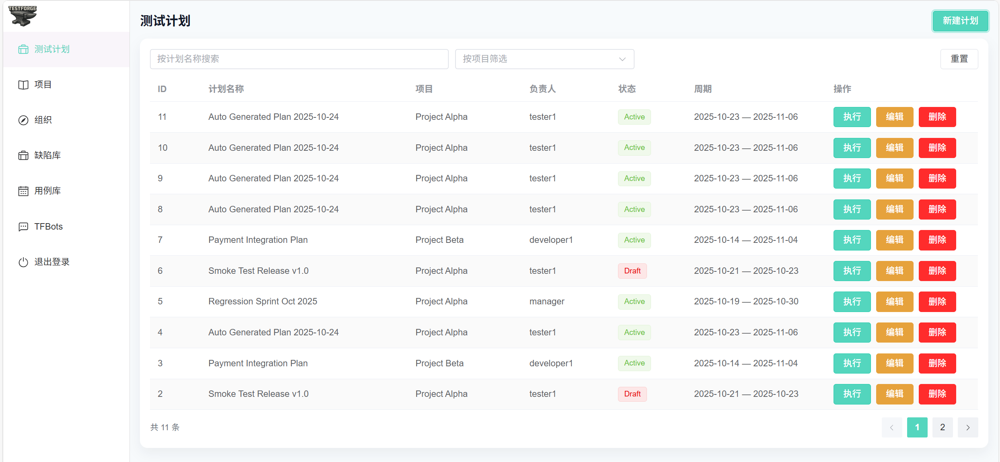

在建立好了一个测试计划后，我们可以点击执行按钮，进入到计划内部，从而去具体的执行它

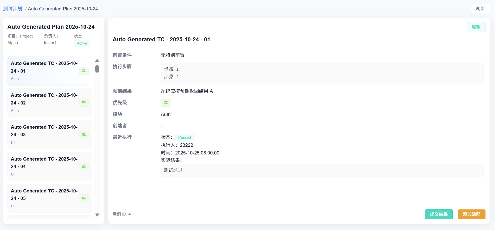

点击右下方的“提交结果”，可以为此用例添加执行状态、执行环境与实际结果，以完成一个完整的用例提交

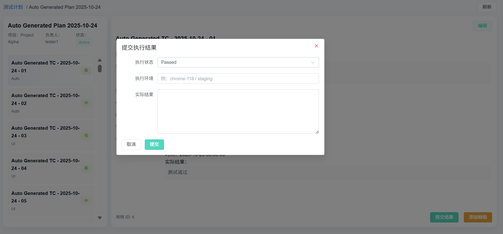

相应的，如果执行出现问题，我们也可以在此页面添加对应的缺陷

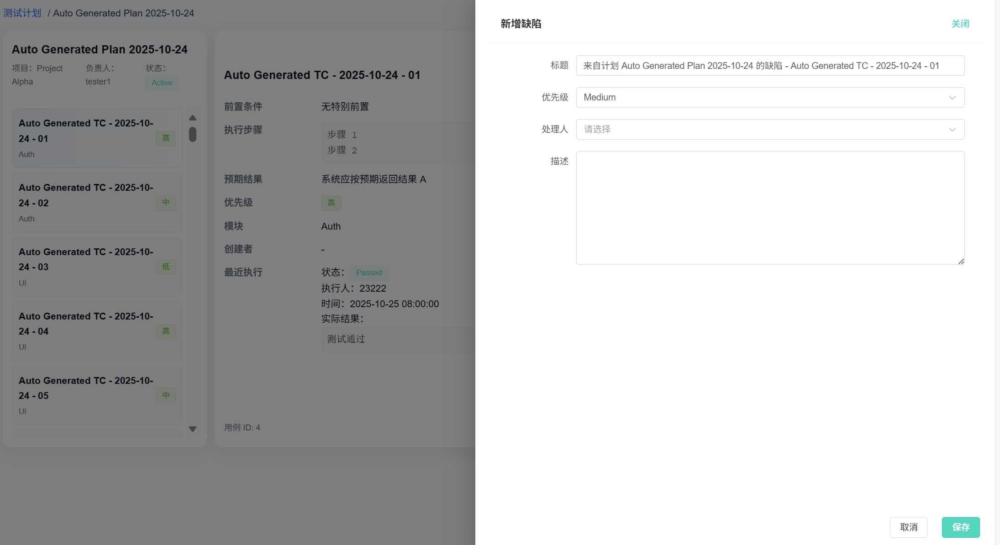

**项目**

在此处，项目管理者可以进行项目信息的编辑与项目成员的管理

  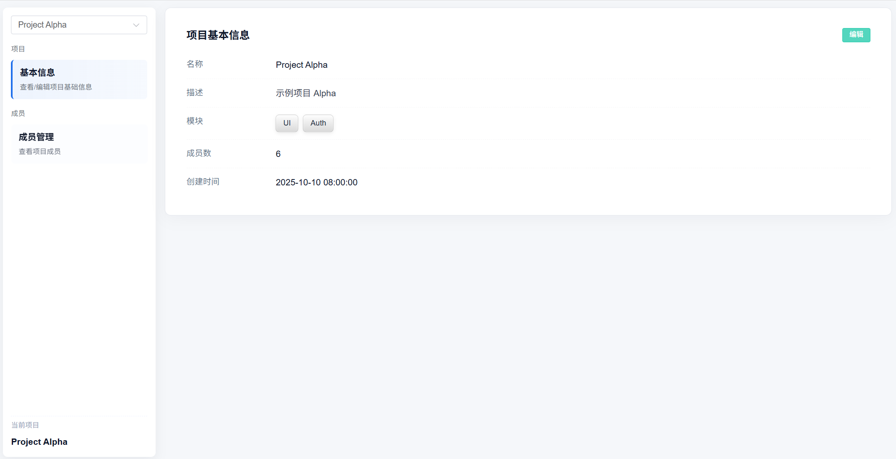 
  项目-项目信息页

  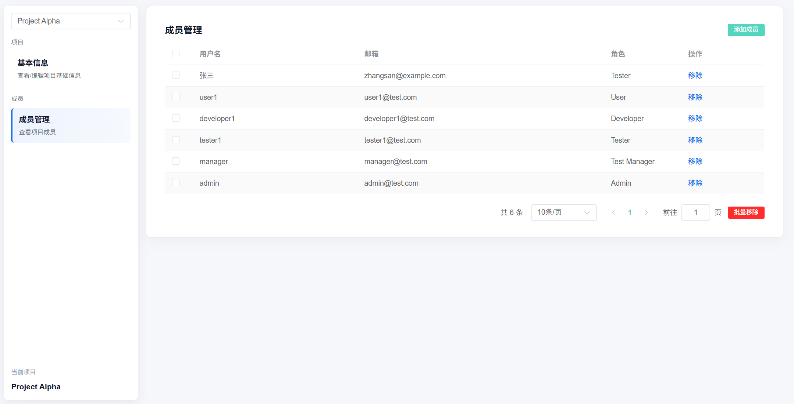 
  项目-成员管理页

**组织**

此处为组织架构的管理页，可以在此管理：

成员的状态、所属部门、角色、激活状态等；

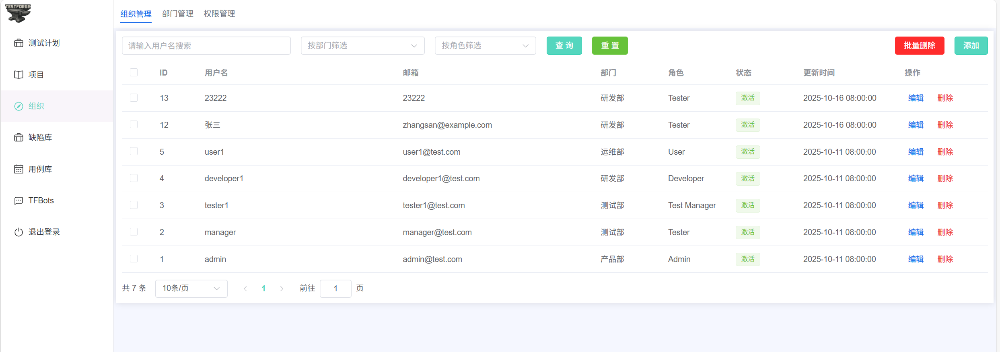

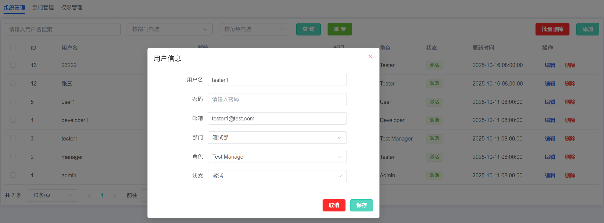

部门，以及它们对应的的成员、描述等；

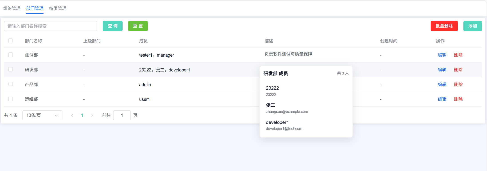

角色，以及它们对应的权限、描述、名称等；

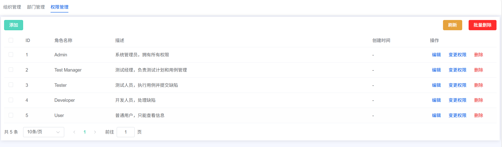

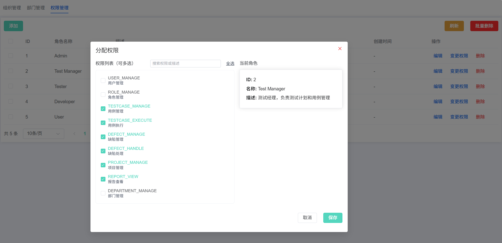

**用例库**

此处为用例管理的页面，在此可以切换项目/模块以查看对应的用例，并对他们进行信息变更、增删改查等操作。

  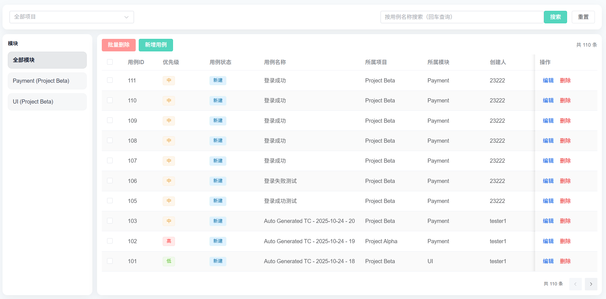 
  用例库

  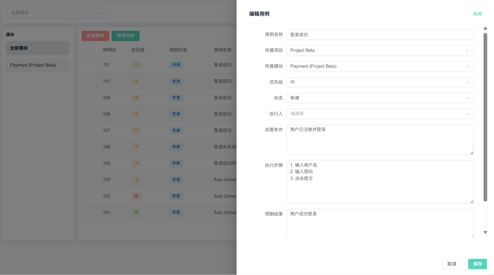 
  用例编辑

**缺陷库**

此处为用例管理的页面，在此可以切换项目/模块以查看对应的缺陷，并对他们进行信息变更、增删改查等操作。

  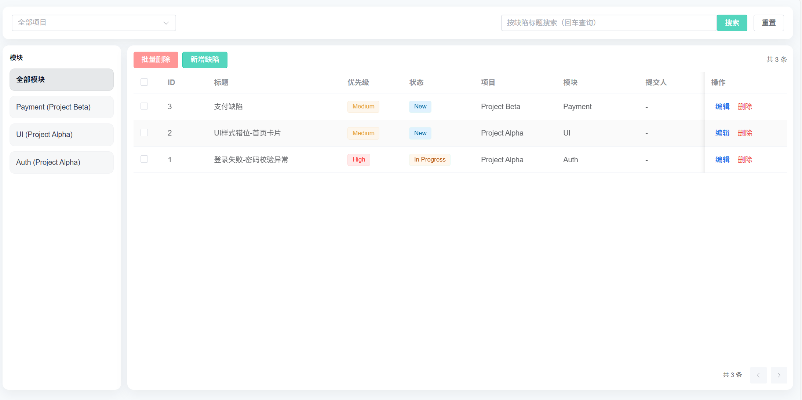 
  缺陷库

  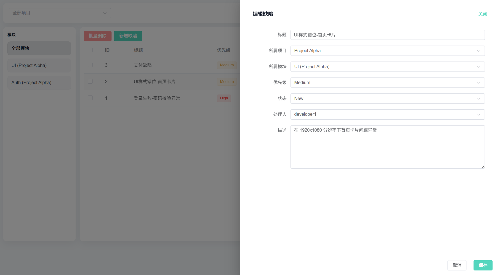 
  缺陷编辑

**TFBots**

此处为智能助手的交互页面，可以在此进行一些获得一些问题的解答，抑或是发出用例生成的指令，让大模型生成相关的用例并导入对应的模块，支持会话管理。

  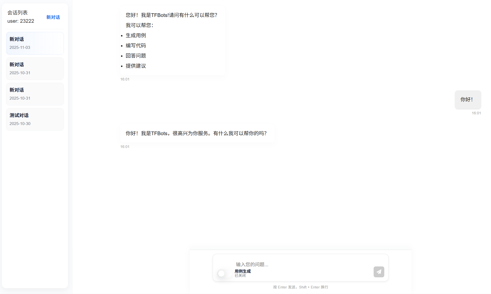 
  正常会话

  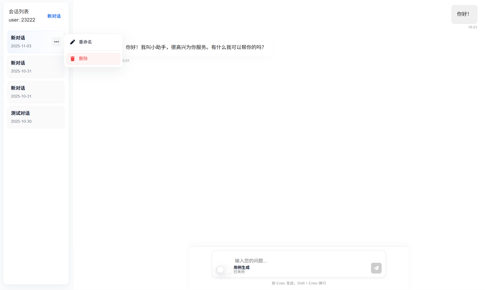 
  会话管理

  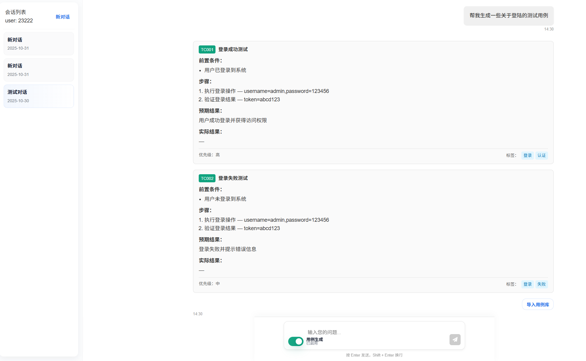 
  用例生成

  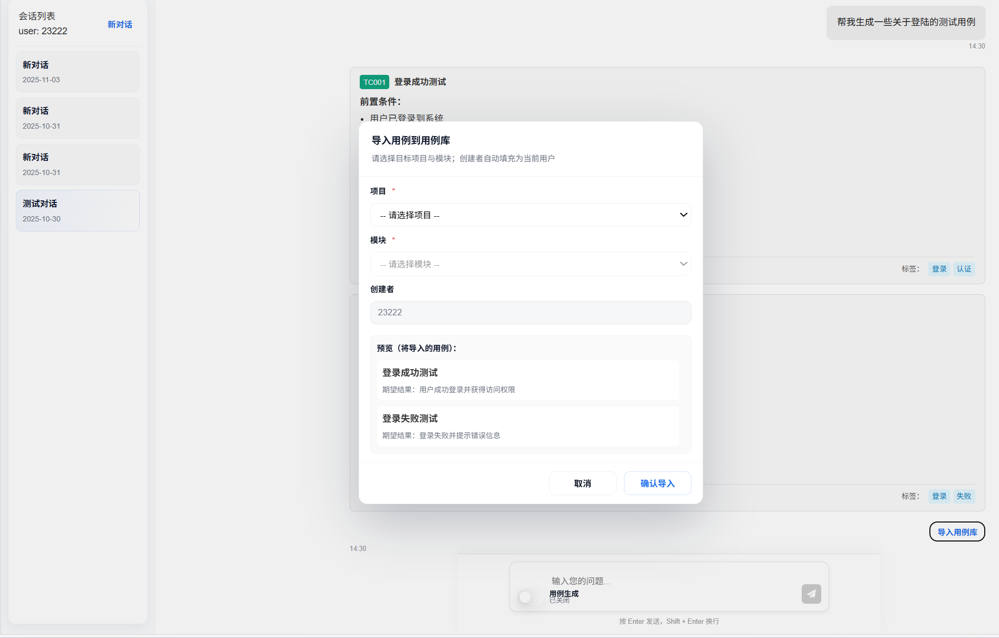 
  一键导入用例库

